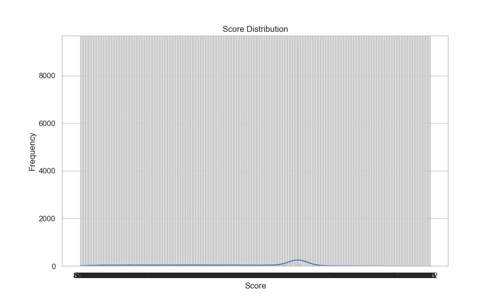
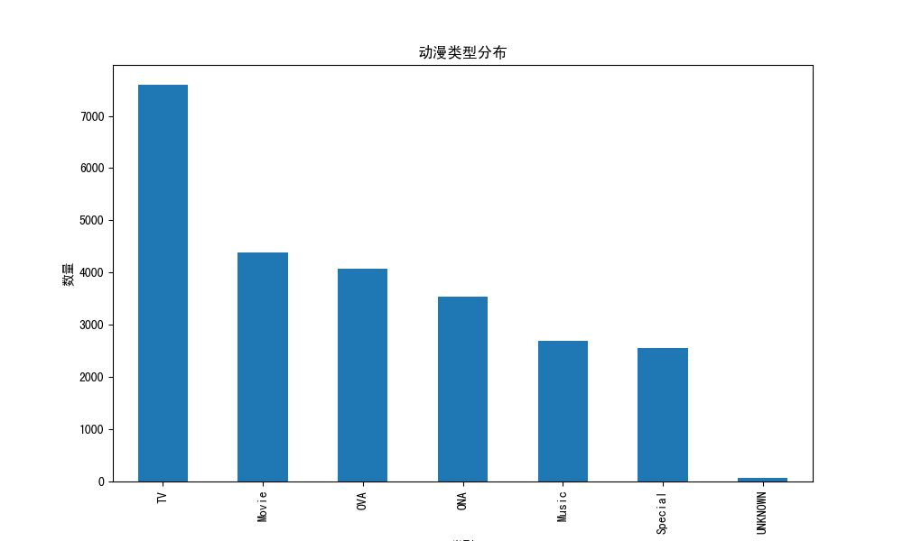

# 动漫数据集分析报告

## 数据集基本信息
- 数据集包含 24905 行和 25 列。
- 数据集列名: anime_id, Name, English name, Other name, Score, Genres, Synopsis, Type, Episodes, Aired, Premiered, Status, Producers, Licensors, Studios, Source, Duration, Rating, Rank, Popularity, Favorites, Scored By, Members, Image URL, Year.

## 数据预处理
- 处理了缺失值，剩余数据行数: 24905.

## 可视化分析
- **评分分布**: 评分主要集中在7到9之间。
  
- **动漫类型分布**: 电视动画是最常见的类型。
  
- **动漫年份分布**: 动漫数量在2010年后显著增加。
  
