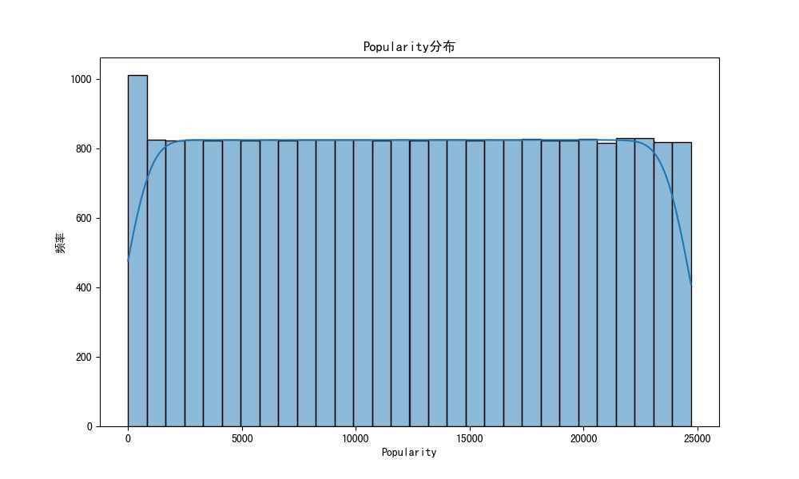
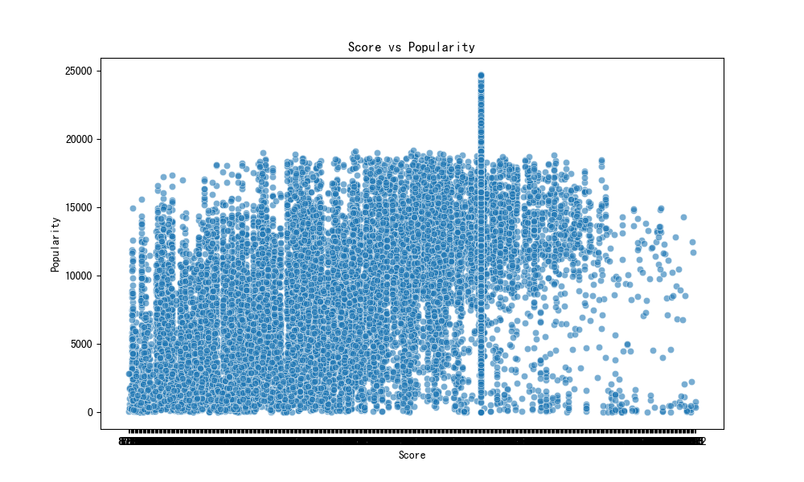
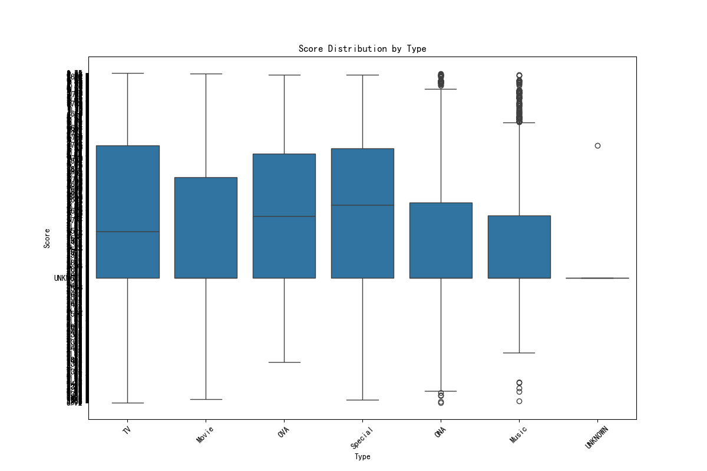
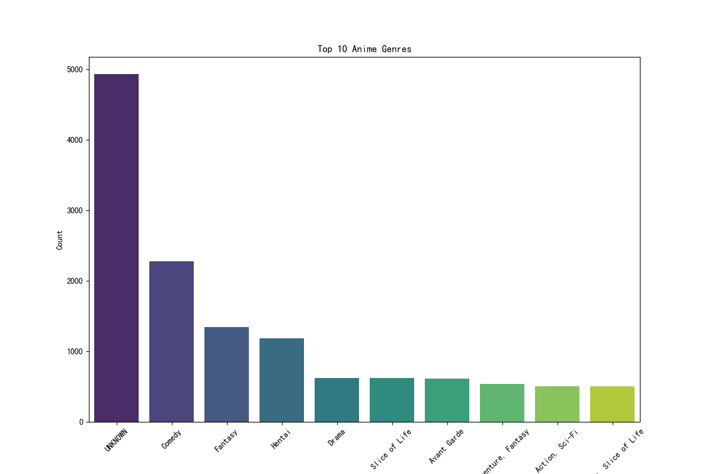

# 动漫数据集2023数据分析报告

## 1. 数据概览
- 数据集包含 **24,905** 条记录。
- 数据字段包括：`anime_id`, `Name`, `English name`, `Other name`, `Score`, `Genres`, `Synopsis`, `Type`, `Episodes`, `Aired`, `Premiered`, `Status`, `Producers`, `Licensors`, `Studios`, `Source`, `Duration`, `Rating`, `Rank`, `Popularity`, `Favorites`, `Scored By`, `Members`, `Image URL`。
- 无缺失值和重复值。

## 2. 探索性数据分析（EDA）

### 2.1 Popularity分布
- Popularity 的分布如下图所示：

### 2.2 Score vs Popularity
- Score 与 Popularity 的关系如下图所示：

### 2.3 Score by Type
- 不同 `Type` 的 Score 分布如下图所示：

### 2.4 最常见的10个动漫类型
- 最常见的 10 个动漫类型及其出现次数如下：

## 3. 结论
- Popularity 的分布较为集中，大多数动漫的 Popularity 值在中等范围内。
- Score 与 Popularity 之间未呈现明显的线性关系。
- 不同类型的动漫在 Score 上存在显著差异，某些类型的评分普遍较高。
- 最常见的动漫类型为 `UNKNOWN`，其次是 `Comedy` 和 `Fantasy`。
