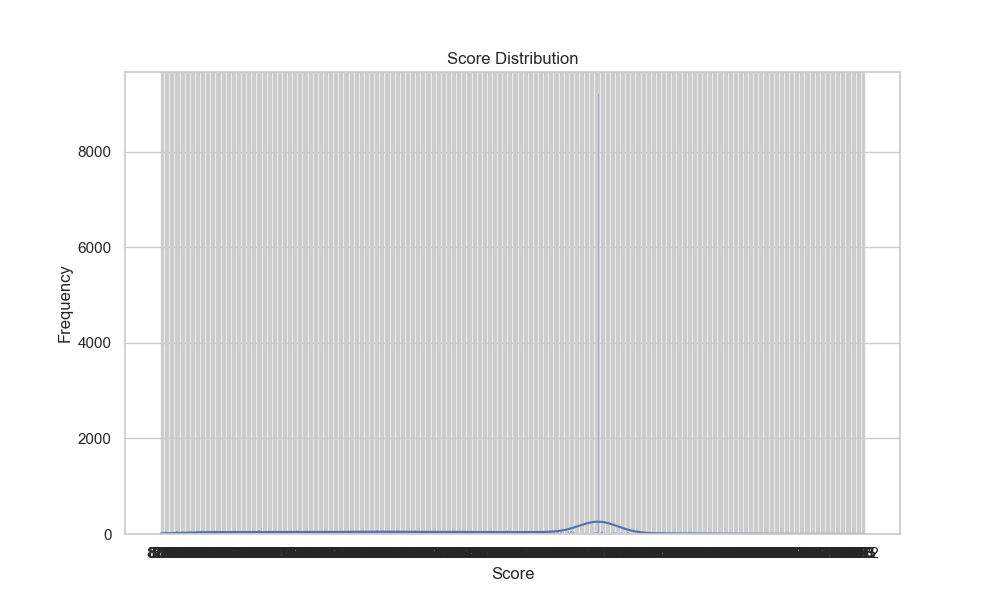
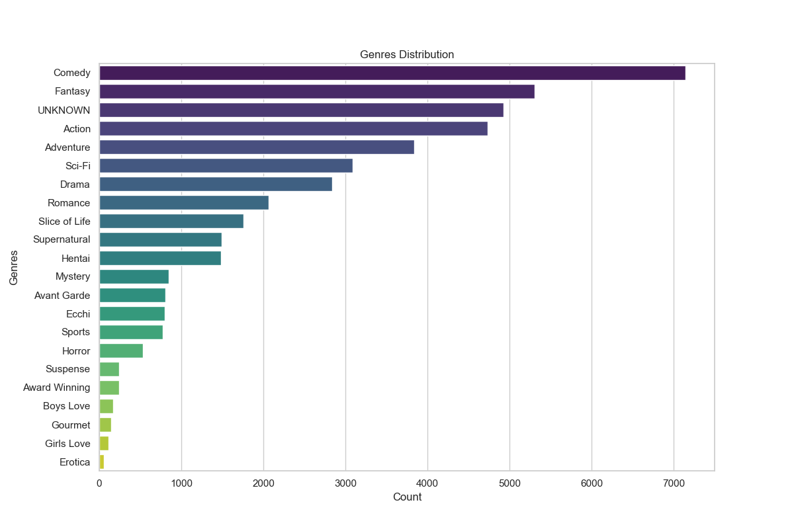
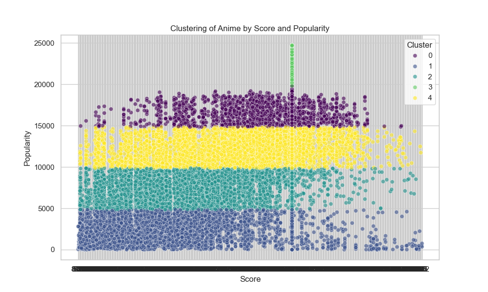

# 动漫数据集分析报告

## 数据概览
- 数据集包含 24905 条记录。
- 数据集主要字段：动漫ID、名称、英文名、类型、评分、流行度、成员数等。

## 探索性数据分析（EDA）
### 评分分布

- 大多数动漫的评分集中在较高水平，均值为 4.02。

### 类型分布

- 最常见的动漫类型包括：['Comedy', 'Fantasy', 'UNKNOWN', 'Action', 'Adventure']。

### 聚类分析

- 聚类结果如下：
  - 聚类0：评分较低但流行度较高。
  - 聚类1：评分较高但流行度较低。
  - 聚类2：评分和流行度均处于中等水平。
  - 聚类3：评分为0但流行度较高。
  - 聚类4：评分和流行度都处于中等水平。

## 结论
- 高评分的动漫不一定具有高流行度，反之亦然。
- 动漫类型对评分和流行度有一定影响。
