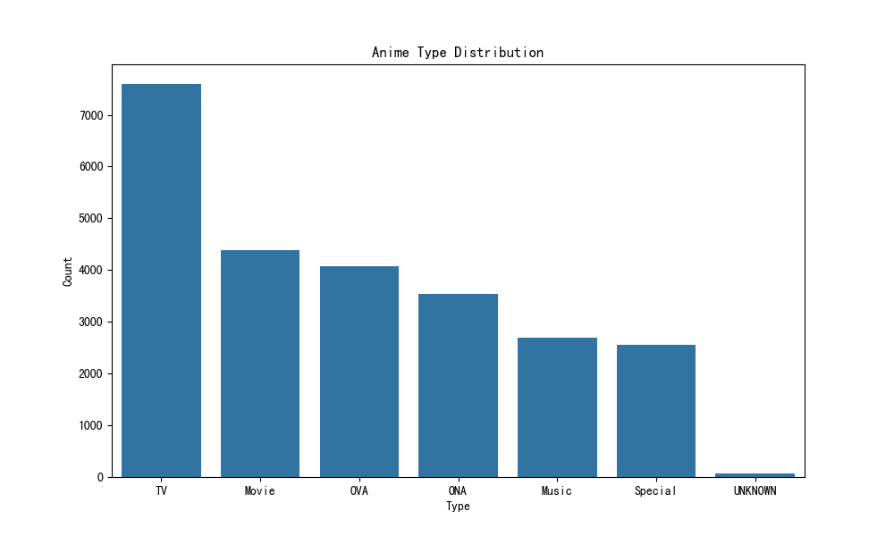
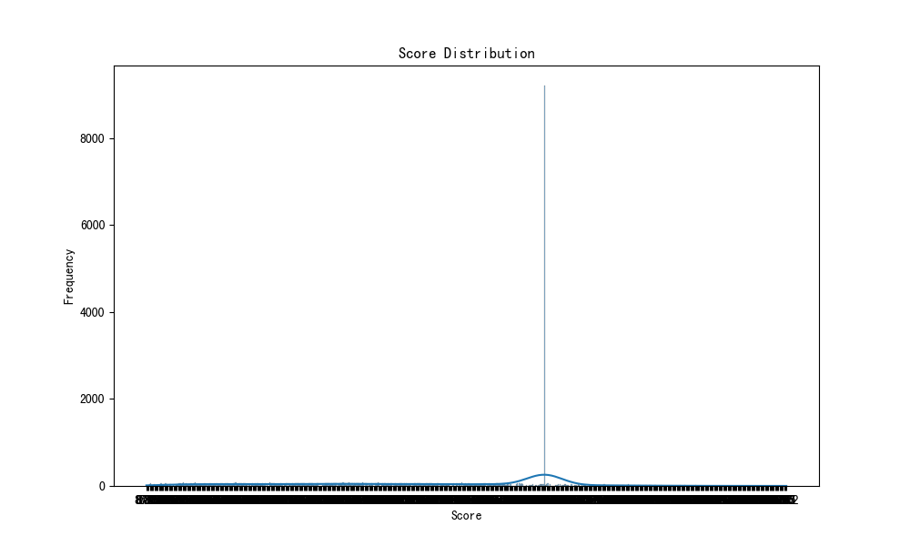
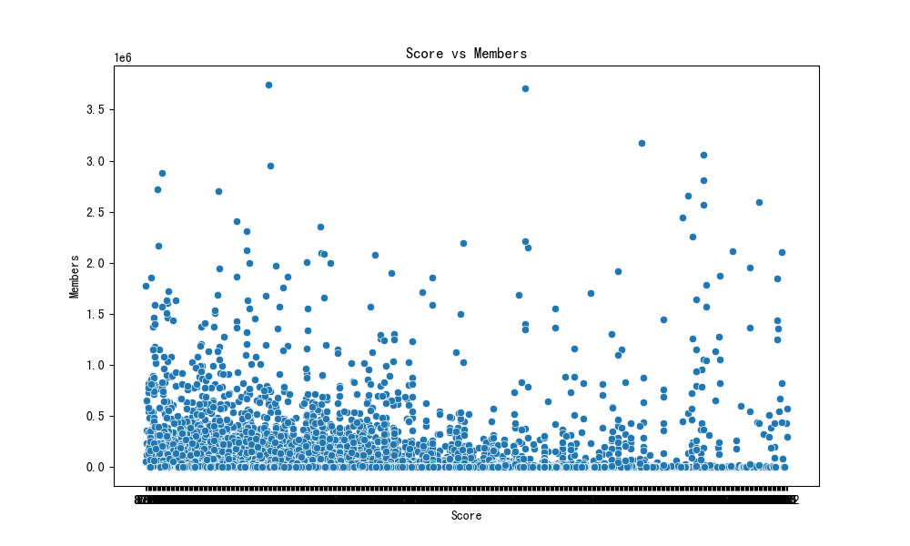

# Anime Dataset Analysis Report

## Overview
- Total number of anime: 24905
- Data columns: ['anime_id', 'Name', 'English name', 'Other name', 'Score', 'Genres', 'Synopsis', 'Type', 'Episodes', 'Aired', 'Premiered', 'Status', 'Producers', 'Licensors', 'Studios', 'Source', 'Duration', 'Rating', 'Rank', 'Popularity', 'Favorites', 'Scored By', 'Members', 'Image URL']

## Anime Type Distribution

## Score Distribution

## Top 10 Highest Rated Animes
| Name                     | English name                | Score   |
|:-------------------------|:----------------------------|:--------|
| Shijuuku Nichi           | UNKNOWN                     | UNKNOWN |
| Renlei Bowuguan          | UNKNOWN                     | UNKNOWN |
| Lao Po Po De Zao Shu     | UNKNOWN                     | UNKNOWN |
| Xiao Li Yu Tiao Long Men | UNKNOWN                     | UNKNOWN |
| Xiao Pengyou Men         | UNKNOWN                     | UNKNOWN |
| Yi Ge Xin Zu Qiu         | UNKNOWN                     | UNKNOWN |
| Shuang Bao Tai           | UNKNOWN                     | UNKNOWN |
| San Ge Linju             | UNKNOWN                     | UNKNOWN |
| Okama Hakusho            | Okama Report                | UNKNOWN |
| Pangsao Hui Niangjia     | Mrs. Pang Visits Her Mother | UNKNOWN |

## Relationship Between Score and Members

