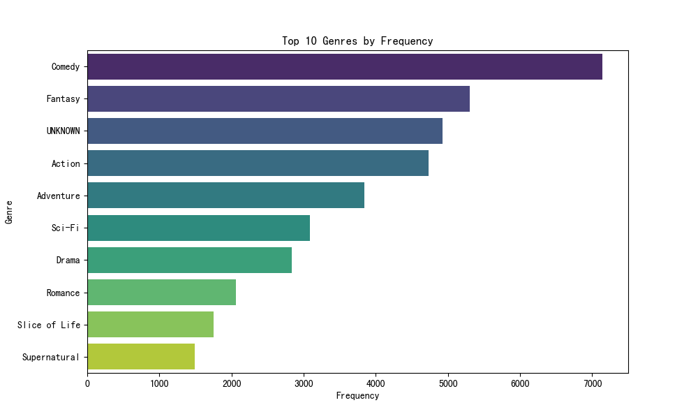

# Anime Dataset 2023 Analysis Report

## Overview

This report provides an analysis of the anime dataset for the year 2023. The dataset contains information about various anime, including their scores, genres, members, and other attributes.

## Descriptive Statistics

The dataset consists of 24,905 anime entries. Here are some key statistics:

- Mean Popularity: 12,265
- Mean Favorites: 432
- Mean Members: 37,105

## Missing Values

There are no missing values in the dataset.

## Key Insights

### Distribution of Scores

### Top 10 Genres by Frequency

### Relationship between Score and Members

### Top 10 Anime by Popularity

### Top 10 Anime by Favorites

### Top 10 Anime by Scored By

### Top 10 Anime by Members

