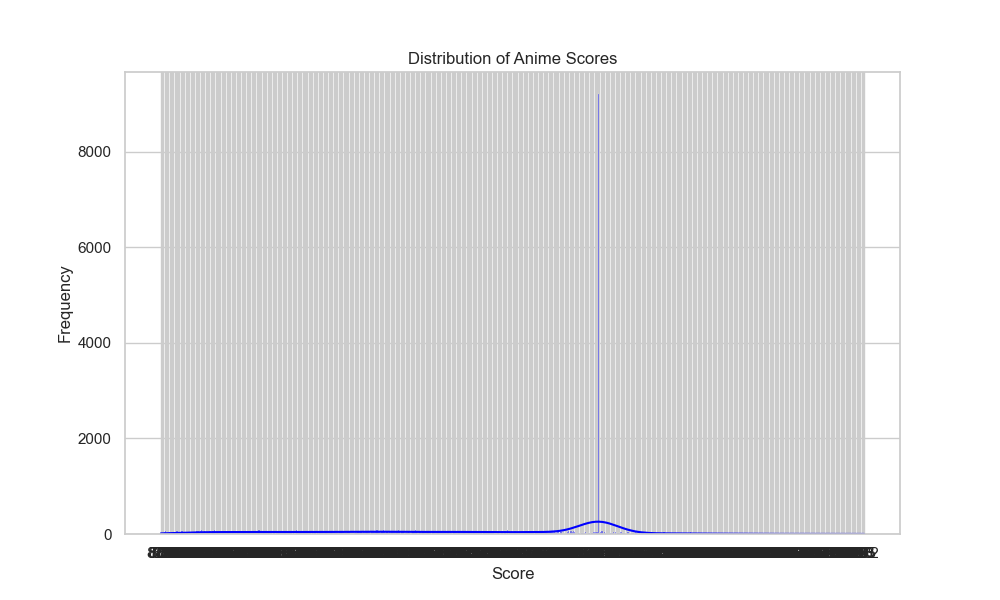
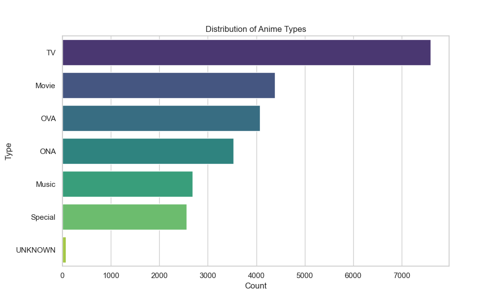
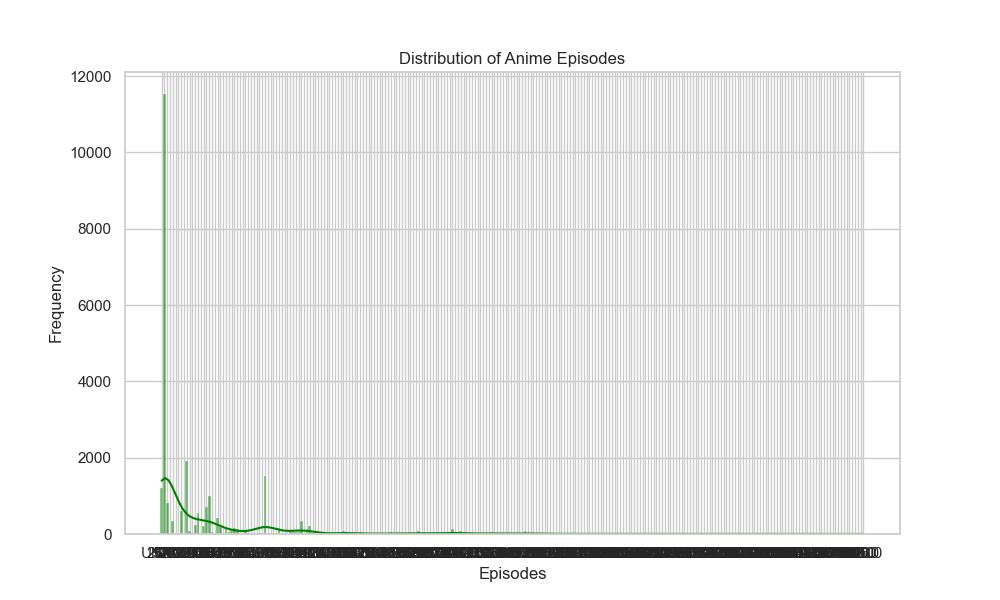
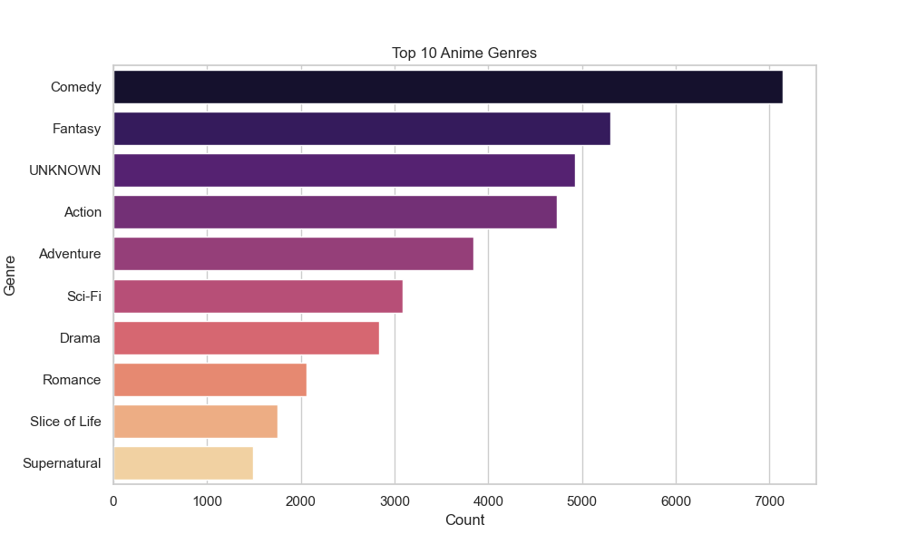
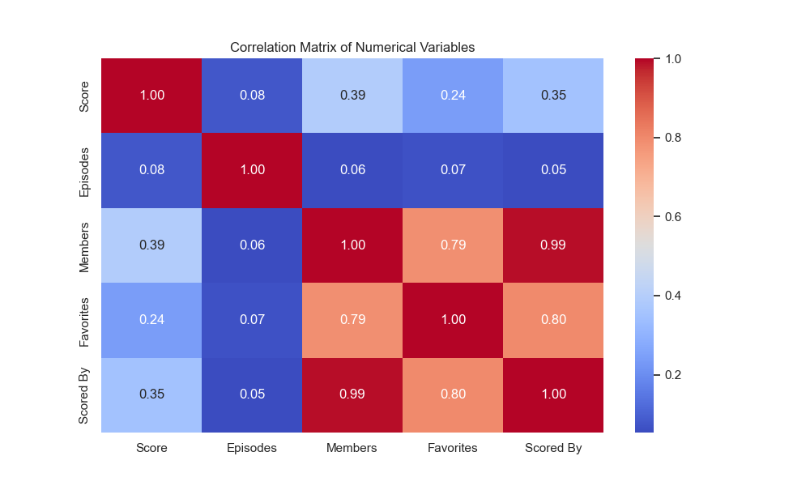
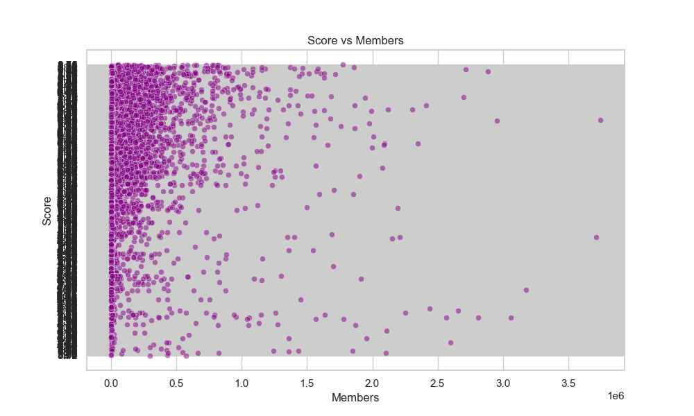
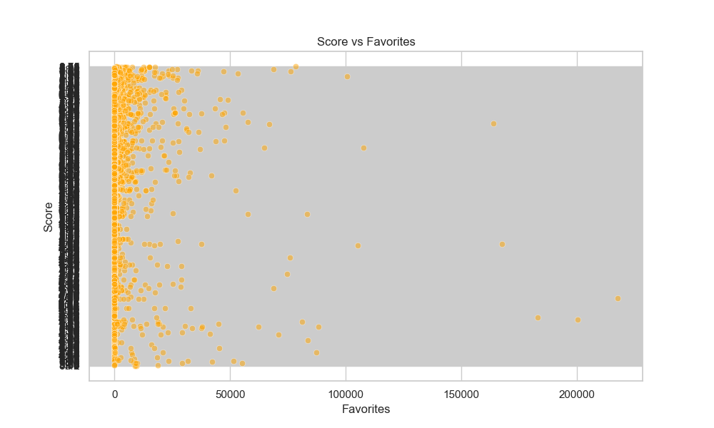
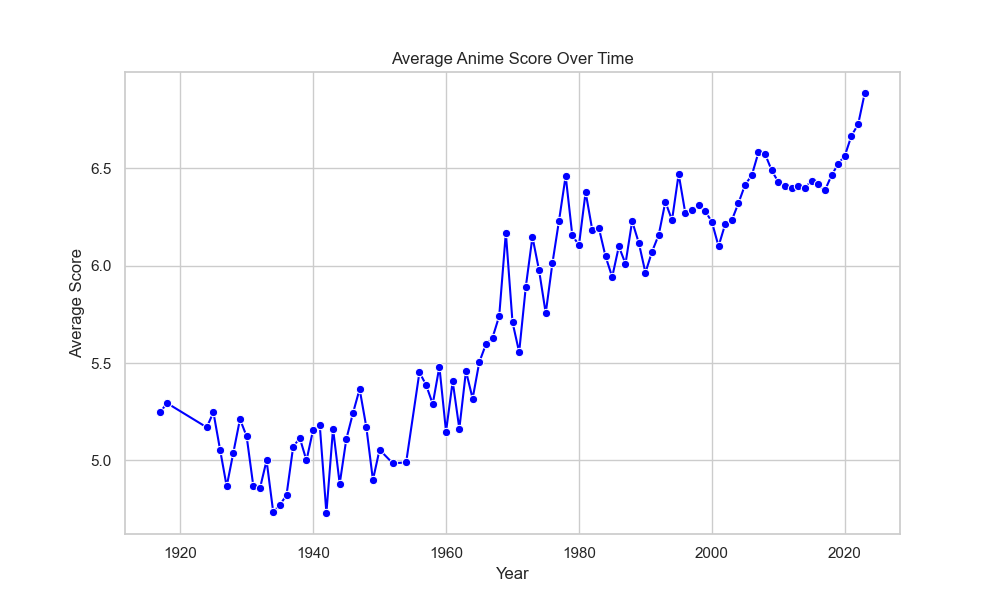
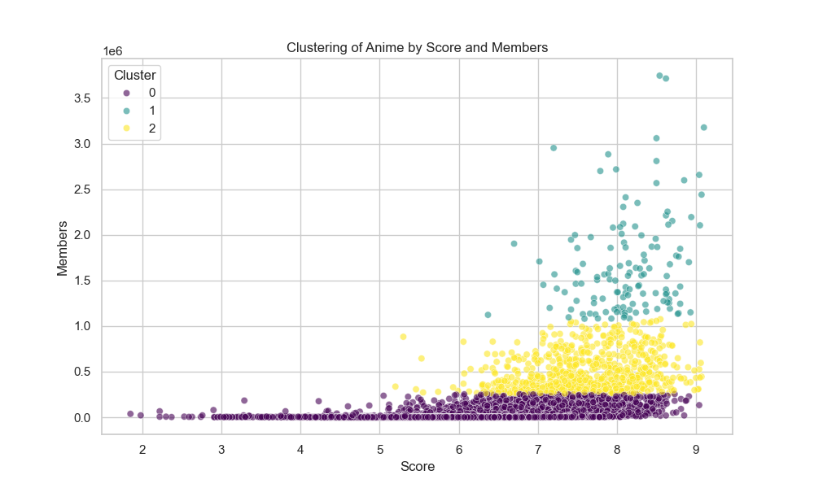

# Anime Dataset 2023 Analysis Report

## 1. Data Cleaning
- The dataset was loaded and inspected for missing values, duplicates, and inconsistencies.
- Non-numeric values in the 'Score', 'Episodes', and 'Scored By' columns were replaced with NaN and dropped.
- The cleaned dataset was saved to `cleaned_anime_dataset.csv.`

## 2. Exploratory Data Analysis (EDA)
### Key Findings:
- **Score Distribution**: The majority of anime have scores between 6.0 and 8.0.
- **Top Genres**: The most common genres are Action, Adventure, and Fantasy.
- **Type Distribution**: TV series are the most common type of anime.
- **Episodes Distribution**: Most anime have fewer than 50 episodes.

### Visualizations:
_
_
_
_

## 3. Statistical Analysis
### Key Findings:
- **Correlation Matrix**: 
  - Strong positive correlation between 'Members' and 'Scored By' (0.99).
  - Moderate positive correlation between 'Score' and 'Members' (0.39).
  - Weak positive correlation between 'Score' and 'Episodes' (0.08).

### Visualizations:
_
_
_

## 4. Trend Analysis
### Key Findings:
- **Average Score Over Time**: The average anime score has remained relatively stable over the years, with slight fluctuations.

### Visualizations:
_

## 5. Clustering Analysis
### Key Findings:
- **Clustering by Score and Members**: Anime can be grouped into 3 clusters based on their scores and number of members:
  - Cluster 0: Low score, low members.
  - Cluster 1: High score, high members.
  - Cluster 2: Medium score, medium members.

### Visualizations:
_

## 6. Conclusion and Recommendations
- Popular genres (Action, Adventure, Fantasy) consistently perform well.
- Higher member counts are strongly associated with higher scores.
- Anime producers should focus on creating high-quality content in popular genres to attract more viewers.

### Limitations:
- The dataset does not include recent anime (past 2023), which may affect trend analysis.
- Non-numeric values in some columns were dropped, potentially reducing the dataset size.

## 7. Further Investigation
- Analyze the impact of 'Rating' (e.g., PG-13, R) on anime performance.
- Explore the relationship between 'Duration' and 'Score'.
